# 🎨 Color Reference
A complete visual reference guide for all CSS named colors, organized by color families with hex codes and visual swatches. <!--visual swatches means it presents a visual preview insted of writing their color names-->

# 🖌 Color Families Covered

   | Family | Colors |
   |---|---|
   | ⬛ Blacks & Near-Blacks | 10 |\
   | 🩶 Grays & Charcoals | 15 |
   | ⬜ Whites & Off-Whites | 20 |
   | 🔴 Reds | 24 |
   | 🟠 Oranges | 17 |
   | 🟡 Yellows | 17 |
   | 🟢 Greens | 32 |
   | 🔵 Blues | 36 |
   | 🟣 Purples & Violets | 28 |
   | 🩷 Pinks & Roses | 18 |
   | 🟤 Browns & Earth Tones | 32 |
   | 🩵 Teals & Cyans | 18 |
   | 🌸 Magentas & Fuchsias | 13 |
   | 🥈 Metallics & Specials | 12 |
   | 🌈 Neon & Fluorescent | 13 |
   | 🌿 Nature & Pastels | 19 |

# 📖 What Each Entry Contains
- **Visual Swatch** — actual background color so you can see it instantly
- **Color Name** — CSS name or  descriptive name
- **Hex Code** — Copy Ready hex value

# 📌 Quick Reference — Most Used Colors

| Color Name | Hex |
|---|---|
| Red | `#FF0000` |
| Blue | `#0000FF` |
| Green | `#008000` |
| Black | `#000000` |
| White | `#FFFFFF` |
| Gray | `#808080` |
| Orange | `#FFA500` |
| Yellow | `#FFFF00` |
| Purple | `#800080` |
| Pink | `#FFC0CB` |

# ***All color families with shades, tints, and variations***

- **Blacks & Near-Blacks**
  
  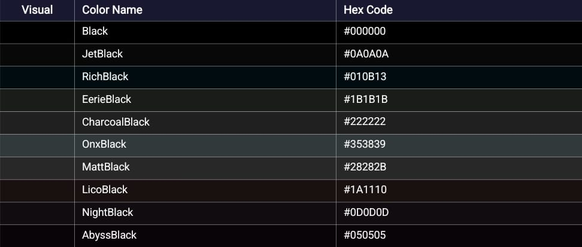

- **Grays & Charcoals**

  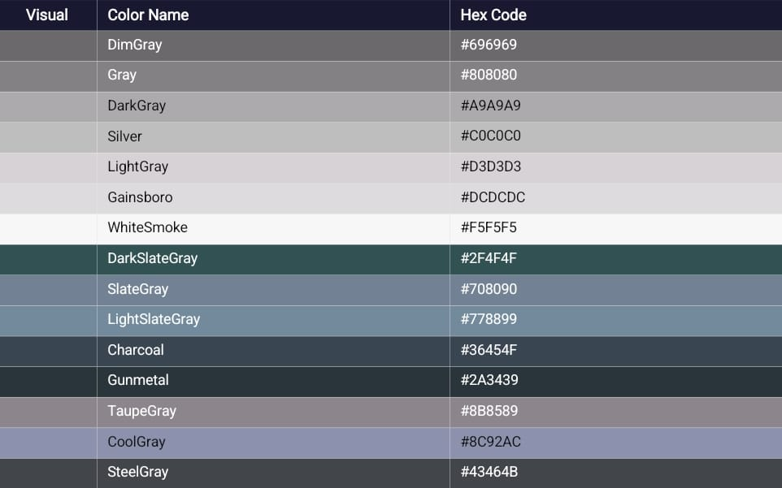

- **Whites & Off-Whites**
  
  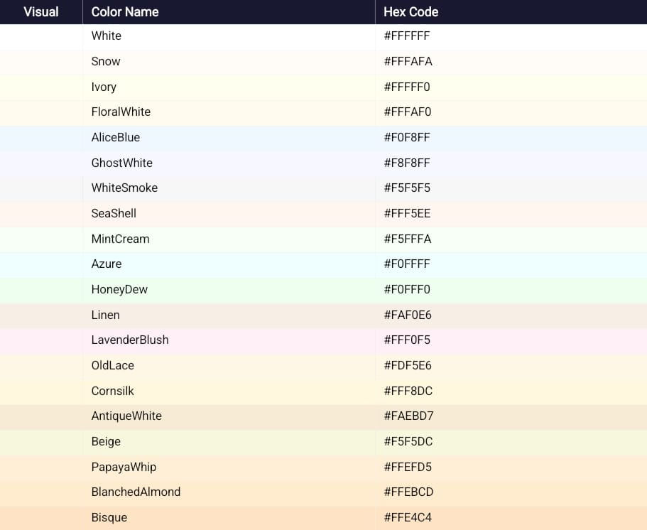

- **Reds**

  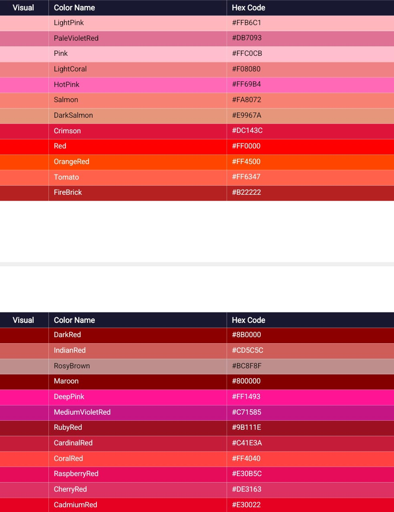

- **Oranges**
  
  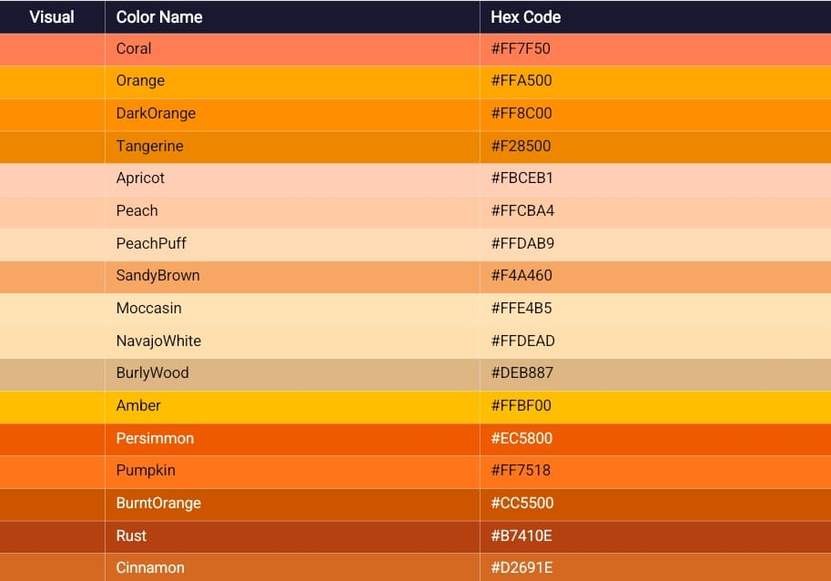

- **Yellows**

  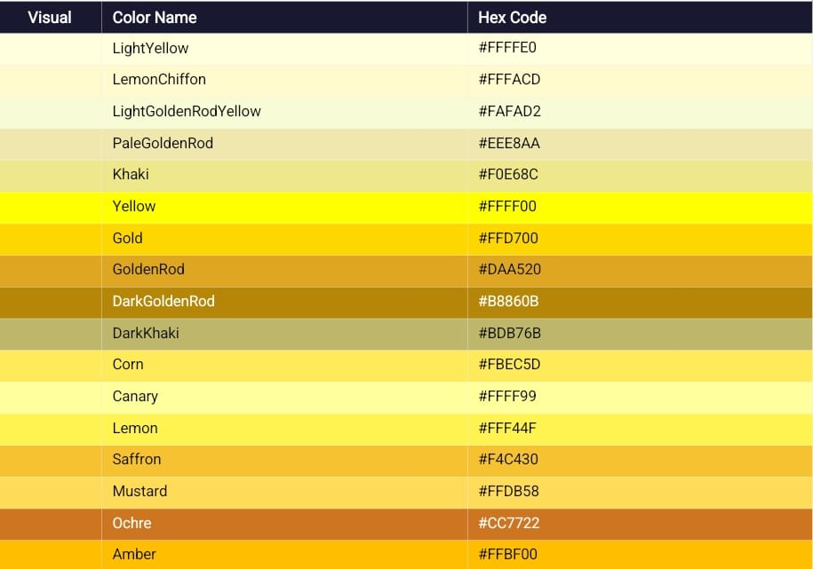

- **Greens**
  
  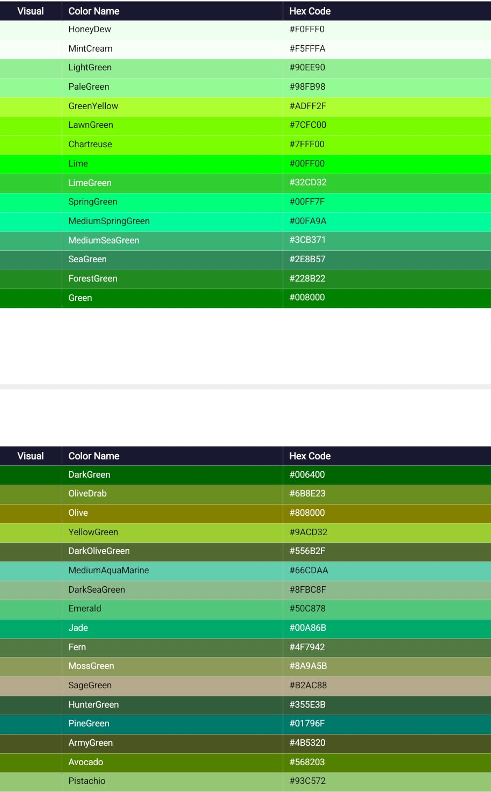

- **Blues**

  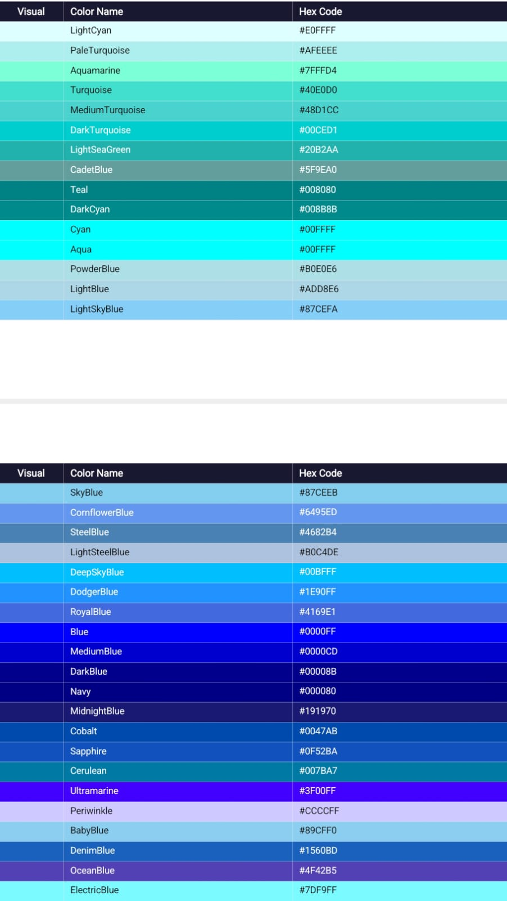

- **Purples & Violets**
  
  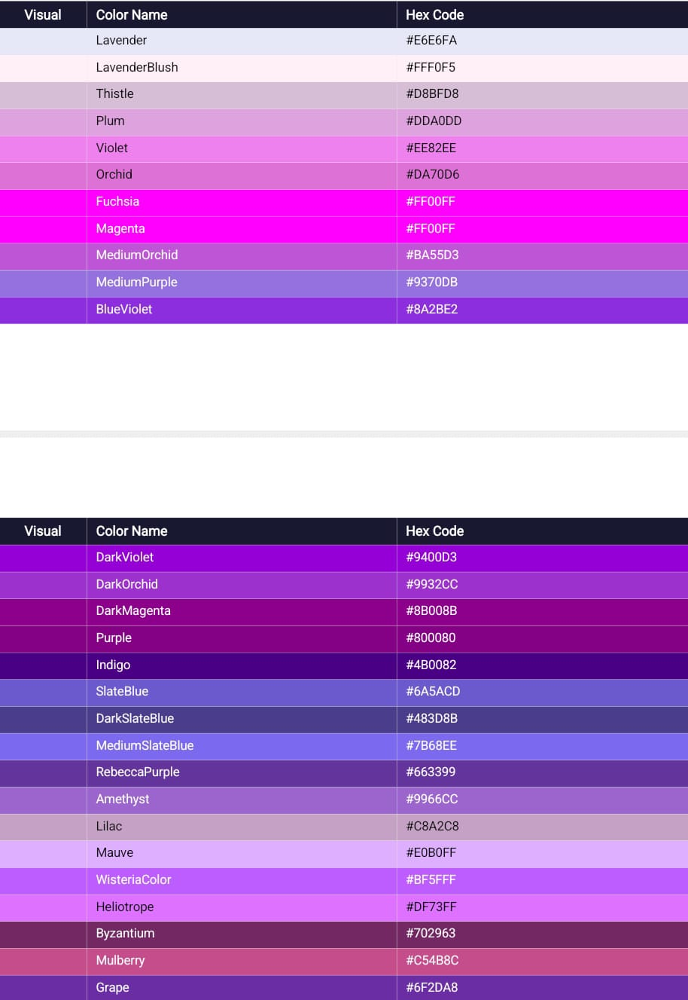

- **Pinks & Roses**

  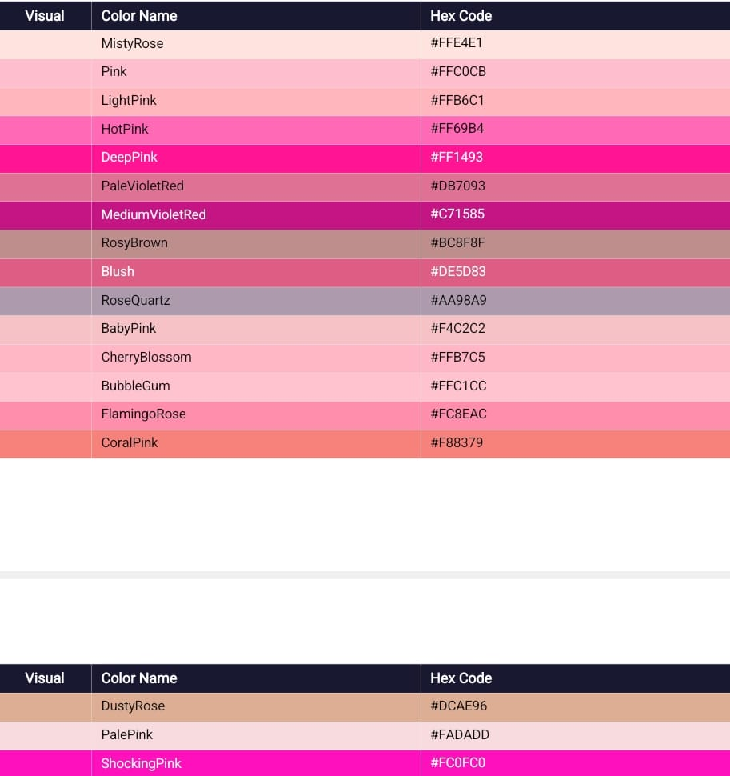

- **Browns & Earth Tones**
  
  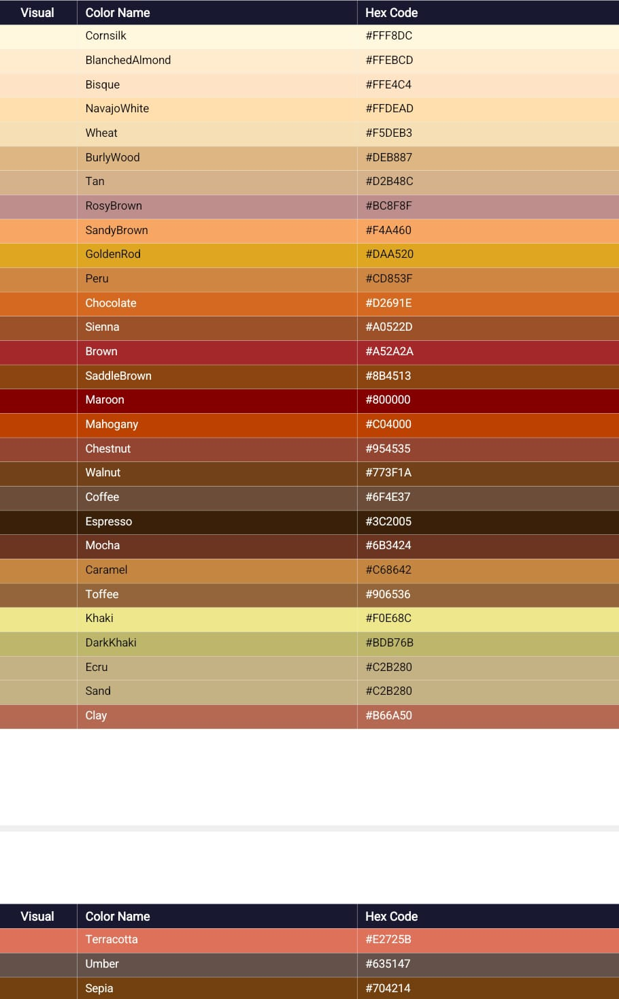

- **Teals & Cyans**

  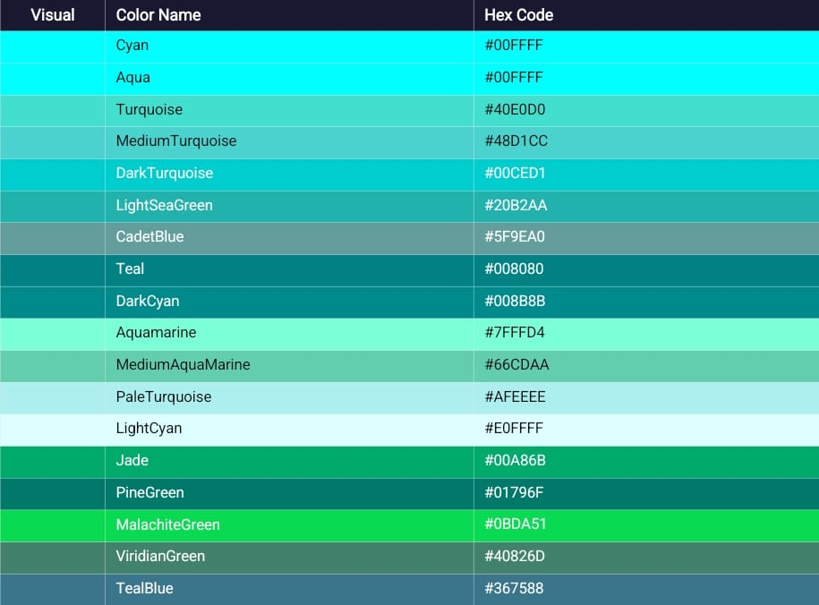

- **Magentas & Fuchsias**
  
  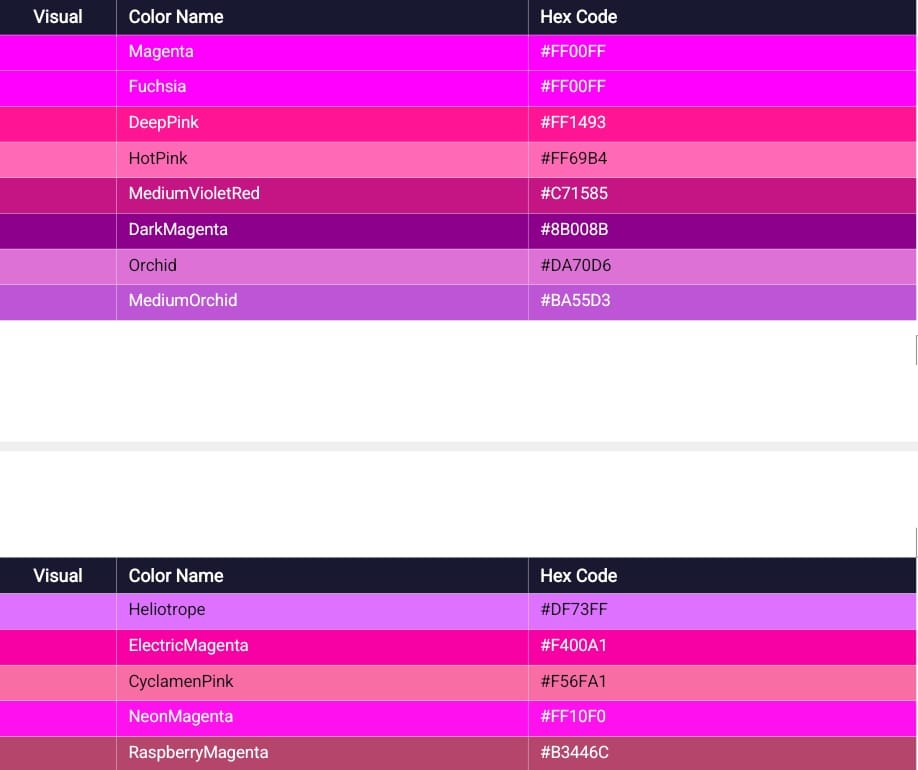

- **Metallics & Specials**

  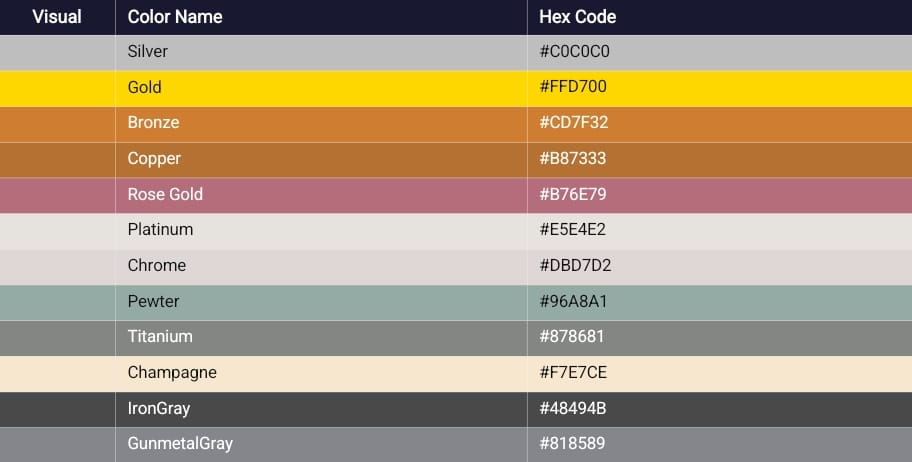

- **Neon & Fluorescent**
  
  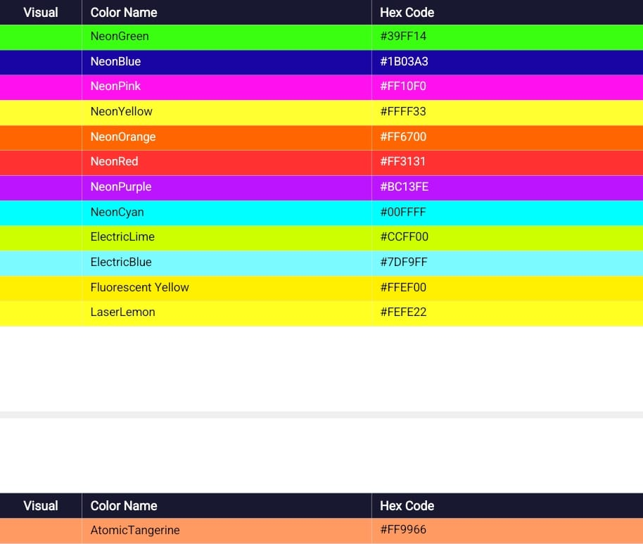

- **Nature & Pastels**

  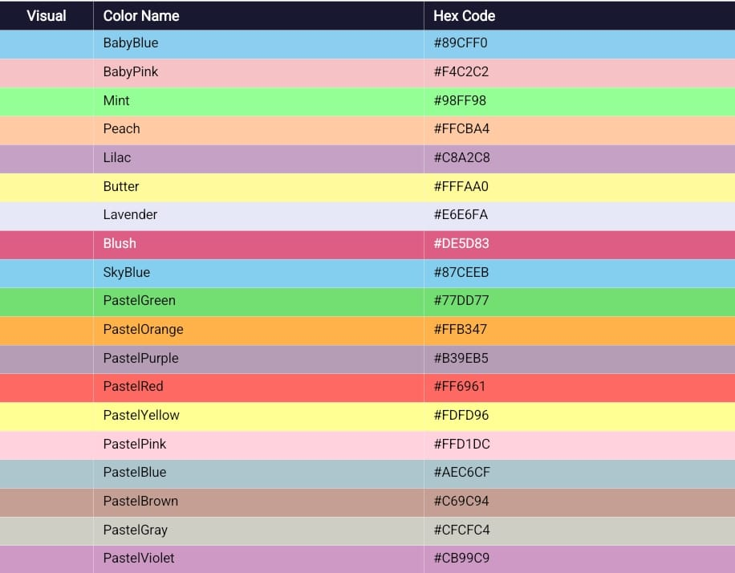
  
# 📩 Download
 ⬇ [Download Full Color Refernce](https://github.com/Tarun25-dev/css-practice/blob/main/color-reference/Full_Color_Reference.docx)
