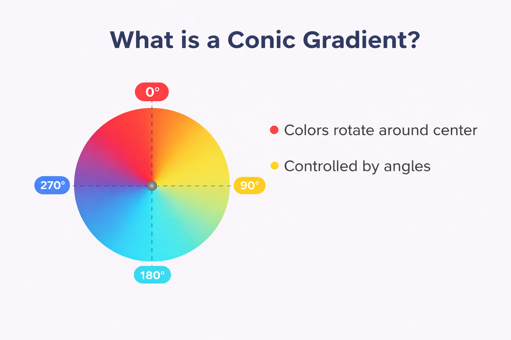

# Conic Gradient

A conic gradient is a CSS gradient where colors are distributed around a center point in a circular (rotational) direction.

# Basic Syntax
```
conic-gradient(color1, color2);
```
# Syntax with Angles
```
conic-gradient(red 0deg 90deg, blue 90deg 180deg);
```
# Syntax with Position
```
conic-gradient(at top left, red, blue);
```
# Example


