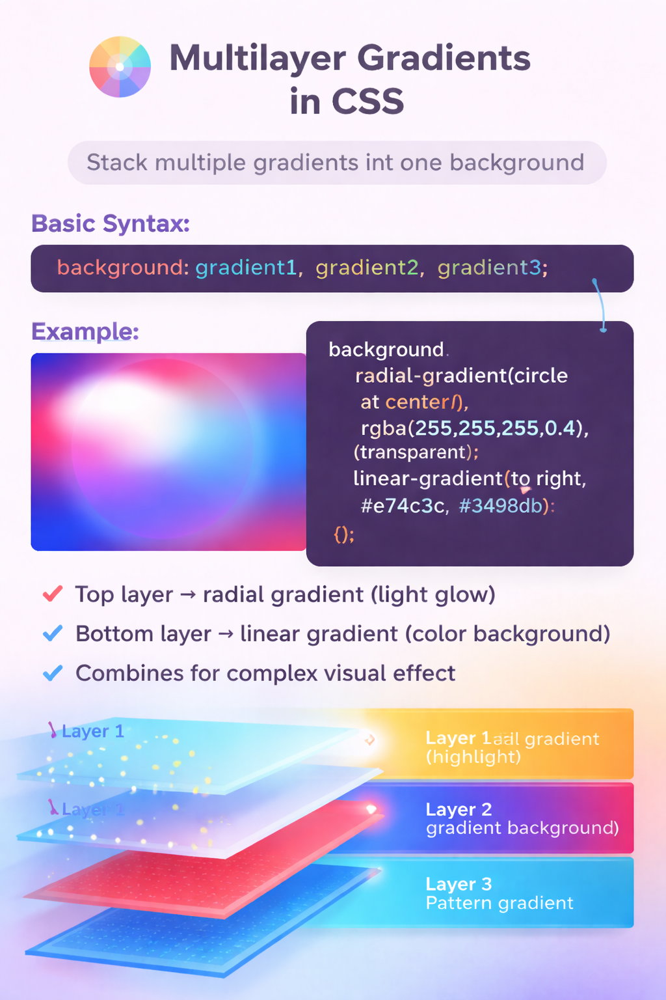

# Multilayer Gradients

A multilayer gradient in CSS means stacking multiple gradients as layers in a single background.
Each gradient acts like a separate background layer, and they are written separated by commas. The first gradient is placed on top, and the next gradients appear below it.

# Basic Syntax
```
background: gradient1, gradient2, gradient3;
```
# Example


