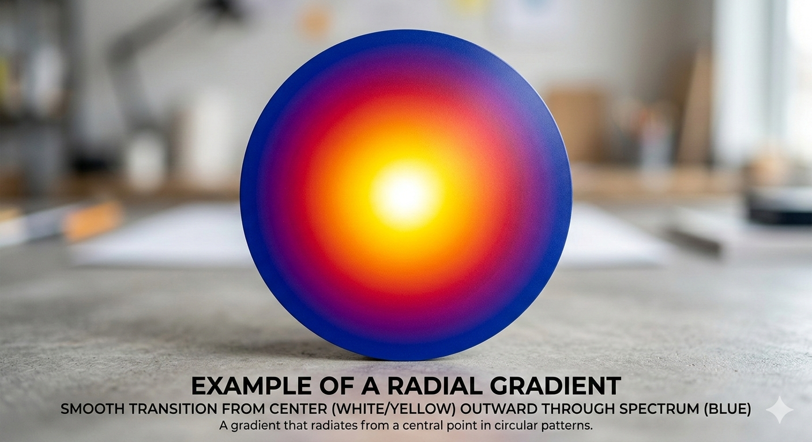

# Radial Gradient

A radial gradient is a type of CSS gradient where colors spread out from a central point in a circular or elliptical shape.

# basic syntax
```
radial-gradient(color1, color2);
```

# syntax with shape
```
radial-gradient(circle, red, blue);
radial-gradient(ellipse, red, blue); # default
```

# syntax with position
```
background: radial-gradient(circle at top right, red, blue); # start from top right corner with circle shape
```
# Example


