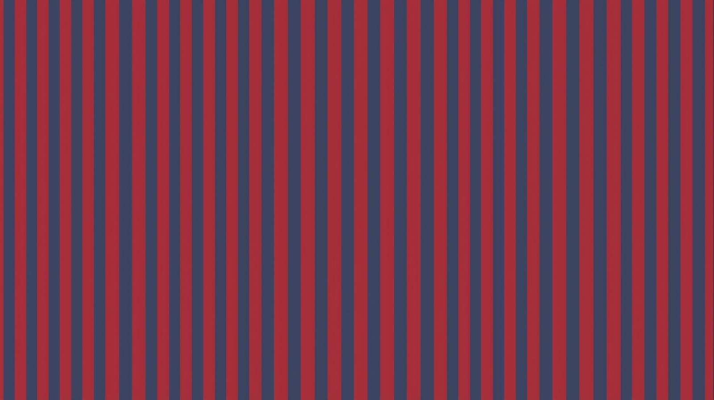

# Repeating Linear Gradient
A repeated linear gradient in CSS is a gradient that repeats its color pattern infinitely in a straight line.It works like linear gradient() but instead of fading once from start to end, the color patterns restarts again and again.

# Basic Syntax
```
repeating-linear-gradient(direction, color-stop1, color-stop2, ...)
```

# Example


