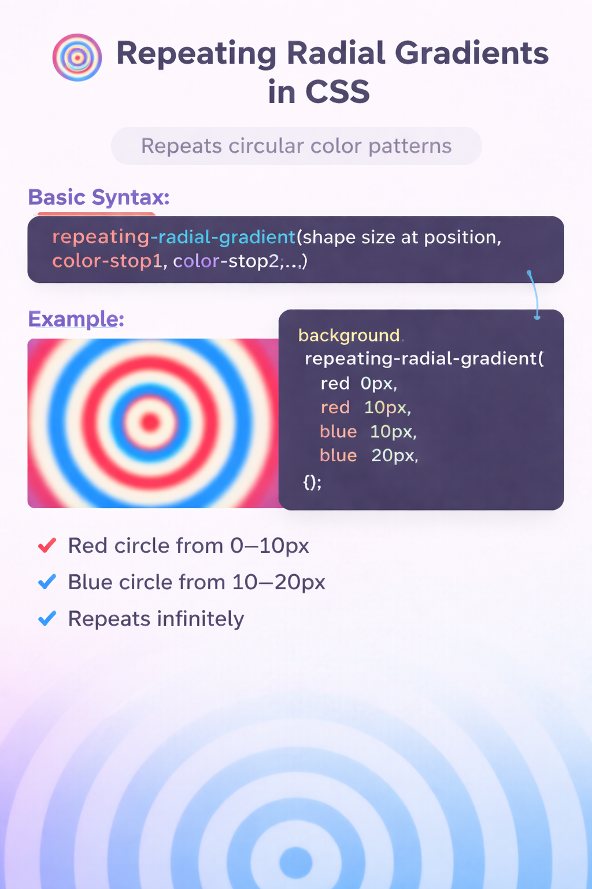

# Repeating Radial Gradient

A repeating radial gradient in CSS is a gradient that repeats circular or elliptical color patterns outward from a center point.
It works like radial-gradient(), but the color stops repeat again and again, creating concentric rings or ripple patterns.

# Basic Syntax

```
repeating-radial-gradient(shape size at position, color-stop1, color-stop2, ...)
```

# Example


